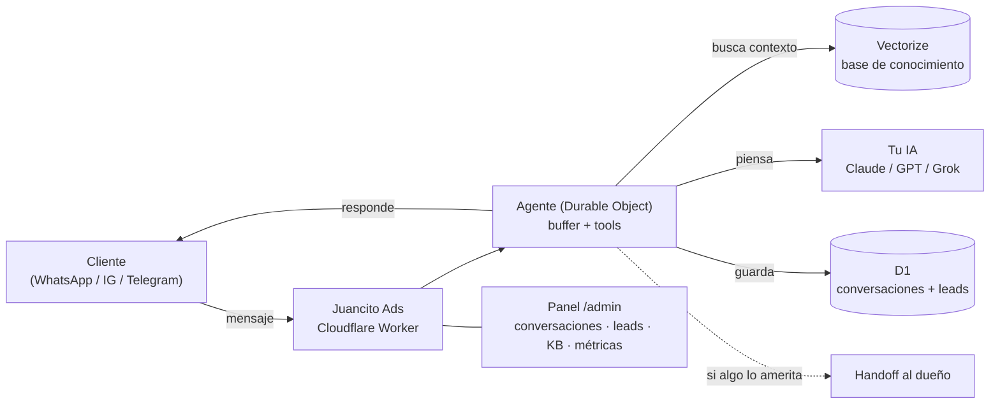

<div align="center">

# 📣 CRM Juancito Ads

### Tu chatbot de IA con CRM para WhatsApp, Instagram y Telegram — en **tu propia nube**, gratis y open source.

**Atiende a tus clientes 24/7, responde desde tu base de conocimiento, y te avisa a ti cuando algo lo amerita.** Vive en tu cuenta de Cloudflare, con tu llave de IA. Tus datos son tuyos. Sin mensualidades de SaaS.

<em>Self-hosted, open-source AI support bot + CRM for small businesses. Lives in **your** Cloudflare, uses **your** AI key. Spanish-first. Deploy in minutes.</em>

[](./LICENSE)
[](https://workers.cloudflare.com/)

[**Instalar**](#-instalar-en-5-minutos) · [**Cómo funciona**](#-cómo-funciona) · [**Roadmap**](#-roadmap) · [**Créditos**](#-créditos-y-origen)

</div>

---

## ¿Qué es Juancito Ads?

Un asistente de soporte con IA que montas **en tu propia infraestructura de Cloudflare** en una tarde — sin saber programar. En lugar de pagar una mensualidad a un SaaS que se queda con tus conversaciones, Juancito Ads vive en tu cuenta, con tu llave de IA, y **todo es tuyo**.

- 💬 **Multicanal** — WhatsApp, Instagram, Messenger y Telegram desde un mismo cerebro.
- 📚 **Aprende de tus documentos** — subes tus FAQ, políticas y guías; el bot busca ahí antes de responder (RAG con base vectorial).
- 🎙️ **Entiende notas de voz** — transcribe los audios de tus clientes automáticamente.
- 🙋 **Sabe cuándo pedir ayuda** — si algo es delicado o no está seguro, te hace *handoff* a ti.
- 📊 **Panel de administración** — conversaciones, leads, base de conocimiento y métricas, todo en `/admin`.
- ☁️ **Vive en tu Cloudflare** — rápido, barato y sin servidores que mantener.
- 🧠 **Tu cerebro, tu llave** — Claude, ChatGPT o Grok; tú eliges y pagas solo lo que piensa.

> **No necesitas saber programar.** Juancito Ads se instala y configura con [Claude Code](https://claude.com/claude-code) como tu copiloto — él corre los comandos por ti, paso a paso.

---

> ### 👋 ¿Eres el dueño y no programas?
> Empieza por **[`EMPIEZA-AQUI.md`](./EMPIEZA-AQUI.md)** — está escrito en simple, cubre el
> despliegue completo y te dice qué pegarle a Claude para que lo haga por ti.

---

## 🚀 Instalar en 5 minutos

### Opción A — con Claude Code (recomendado, no necesitas saber programar)

Abre [Claude Code](https://claude.com/claude-code) en tu terminal y dile:

```
ármame un chatbot con Juancito Ads
```

Claude te explica cómo funciona y cuánto cuesta, verifica que tengas lo necesario, y monta todo por ti: crea tu Cloudflare, despliega el bot y te entrega tu panel vivo. Por debajo corre el instalador:

```bash
node cli/bin/cli.js init     # (será `npx juancitoads init` al publicarlo en npm)
```

### Opción B — manual (si ya programas)

```bash
git clone https://github.com/juanarrietabusiness-pixel/CRM-JuancitoADS mi-chatbot
cd mi-chatbot
pnpm install
# Configura wrangler.toml (tu nombre de worker) y tus secretos
npx wrangler d1 create juancitoads_db  # → pega el database_id en wrangler.toml
npx wrangler secret put ANTHROPIC_API_KEY # (o OPENAI/XAI)
npx wrangler secret put DASHBOARD_PASSWORD
pnpm db:apply:remote
pnpm run deploy
```

Tu panel queda en `https://<tu-worker>.workers.dev/admin`.

[](https://deploy.workers.cloudflare.com/?url=https://github.com/juanarrietabusiness-pixel/CRM-JuancitoADS)

---

## 💸 Cuánto cuesta

Juancito Ads es **gratis y open source**. Lo único que pagas es tu propia infraestructura, y arranca casi en cero:

| Pieza | Costo | Notas |
|---|---|---|
| **Cloudflare** (la casa del bot) | **$0** para empezar · ~$5/mes ya con tráfico real | D1, Vectorize y R2 tienen capa gratis generosa |
| **Cerebro de IA** (tu llave) | ~**$1–2/mes** para un negocio normal | Pagas solo lo que el bot piensa; tu llave, cifrada en tu Cloudflare |

Nadie más toca tus datos ni tus conversaciones.

---

## 🧠 Cómo funciona



Un mensaje entra por un canal → el agente arma contexto desde tu base de conocimiento → tu IA redacta la respuesta con la voz de tu negocio → se responde y se guarda. Si algo es delicado, te avisa a ti.

---

## 🧩 Stack

- **[Cloudflare Workers](https://workers.cloudflare.com/)** (Hono) — el runtime del bot.
- **[Vercel AI SDK](https://sdk.vercel.ai/)** — capa de LLM (Anthropic / OpenAI / xAI, con llave propia).
- **D1** (SQLite) — conversaciones, leads, configuración.
- **Vectorize** (bge-m3) — base de conocimiento / RAG.
- **R2** — media (imágenes, audios).
- **Durable Objects** — el agente que piensa y responde (buffer + tools).

Todo en el ecosistema de Cloudflare: un solo `pnpm run deploy` y está en línea.

---

## 🗺️ Roadmap

Lo que ya funciona está arriba. Lo que viene:

- 🎯 **Giros verticales** — hoy el repo trae el giro `generico`, que sirve para cualquier negocio. Faltan los paneles a la medida (barbería, restaurante, inmobiliaria, clínica…) en `src/niches/`.
- 📇 **CRM completo** — pipeline de ventas, etapas y seguimiento sobre los leads que el bot ya captura.
- 📦 **Publicar el CLI en npm** — para que `npx juancitoads init` funcione sin clonar (ver abajo).

¿Ideas? Ábrelas en [Discussions](https://github.com/juanarrietabusiness-pixel/CRM-JuancitoADS/discussions).

---

## 🔧 Nota sobre el CLI

El instalador (`cli/`) es **autónomo**: baja el código directo de este repo en GitHub.
No hay servidor de licencias, ni cuentas, ni llaves, ni límites de instalación —
todo viene desbloqueado.

Mientras el paquete no esté publicado en npm, `npx juancitoads` todavía no resuelve.
Puedes correrlo desde el repo clonado:

```bash
node cli/bin/cli.js init
```

Para publicarlo tú en npm: el workflow [`publish-cli.yml`](./.github/workflows/publish-cli.yml)
ya está listo con Trusted Publishing (sin tokens). Solo falta que registres el
paquete `juancitoads` en npmjs.com y lo enlaces a este repo y a ese workflow.

Y si quieres probar un fork o una rama antes de publicar:

```bash
JUANCITOADS_REPO=tuusuario/tu-fork JUANCITOADS_REF=tu-rama node cli/bin/cli.js init
```

---

## 🔒 Privacidad — quién ve los datos

**Nadie más que tú.** Juancito Ads corre en TU cuenta de Cloudflare con TUS llaves: las conversaciones de tus clientes viven en tu base de datos y **el bot no envía telemetría ni datos de uso a Juancito Ads ni a nadie**. No hay ping de activación ni analíticas ocultas — puedes revisarlo tú mismo en `src/`.

- Los **mensajes se borran solos a los 90 días** (cron diario). Los leads y tickets se quedan hasta que tú los borres.
- **No se guardan audios ni imágenes**: se transcriben o describen y solo queda el texto.
- Los links del bot cuentan clics, **sin IP ni navegador**.
- El texto de la conversación sí viaja al **proveedor de IA que tú elegiste** (con tu llave) para poder responder.
- Si preguntan si es un bot, **el bot lo admite**. No lo configures para negarlo.

Como dueño del negocio, **tú eres el responsable** de esos datos: avisa a tus clientes que la atención es automatizada y que guardas la conversación, y atiende las solicitudes de borrado. Todo el detalle está en [`PRIVACY.md`](./PRIVACY.md).

---

## 🤝 Contribuir

Los PRs son bienvenidos. Lee [`CONTRIBUTING.md`](./CONTRIBUTING.md) para el flujo, y abre un issue si tienes una idea o encuentras un bug.

---

## 🙏 Créditos y origen

CRM Juancito Ads no se escribió desde cero. Es un derivado de
**[CRM - PanaClaw](https://github.com/abrinay1997-stack/CRM-PANACLAW)**, que a su vez
deriva de **[Forja](https://github.com/santmun/forja)** (Horizontes IA). Los tres son
MIT, y los avisos de copyright de los tres viven en [`LICENSE`](./LICENSE) — ahí
seguirán mientras este código exista, porque es lo que la licencia pide y porque
el trabajo era de ellos primero.

Qué es nuestro y qué heredamos:

| De Juancito Ads | Heredado |
|---|---|
| La identidad: paleta, tipografías, logo e íconos del panel | El motor del bot (Worker, agente, canales, KB) |
| El instalador rebautizado (`juancitoads`) y su documentación | La arquitectura del panel `/admin` y sus 14 vistas |
| Las decisiones de producto que tomemos de aquí en adelante | Los 458 tests que las cubren |

Si vas a usar este repo, ve también a saludar a los de arriba.

<div align="center">

**Hecho con 📣 desde Panamá por Juancito Ads** · [Discussions](https://github.com/juanarrietabusiness-pixel/CRM-JuancitoADS/discussions) · [Issues](https://github.com/juanarrietabusiness-pixel/CRM-JuancitoADS/issues)

</div>
